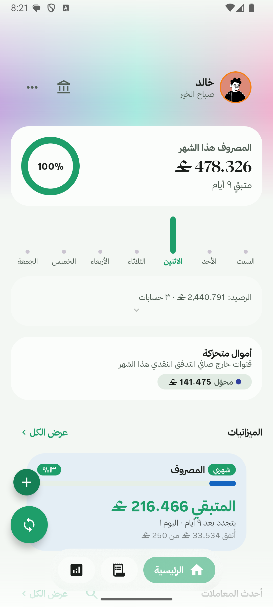
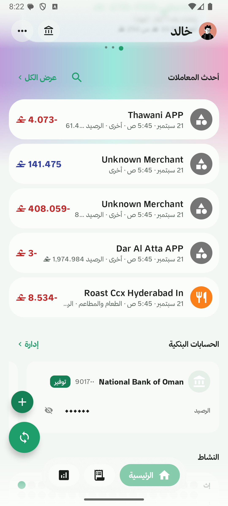
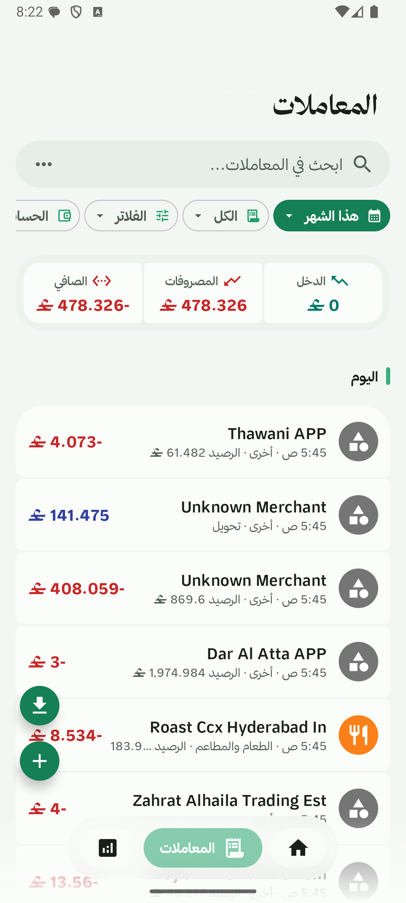
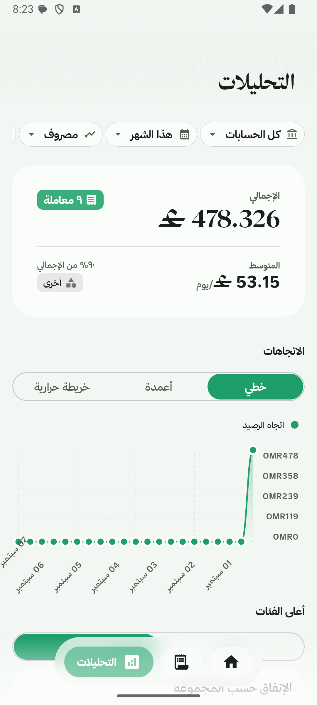

<a name="top"></a>
[](LICENSE)
[](https://developer.android.com/about/versions/oreo/android-8.0)
[](https://kotlinlang.org/)
[](https://github.com/alaisary/expenses-tracker-app/releases)
[](https://github.com/alaisary/expenses-tracker-app/issues)

## غوازي (Ghaway) — private, Arabic-first expense tracker for Omani banks

Turn your bank SMS into a clean, searchable money timeline — entirely on your
phone. No account, no sign-up, and nothing uploaded. غوازي reads the messages
your bank already sends and turns them into transactions, budgets and insights.

> **This is a fork of [PennyWise AI](https://github.com/sarim2000/pennywiseai-tracker).**
> It has been customized for **Omani banks**, **Arabic support**, and
> **improved categories** (grouped Needs/Wants/Savings/Income with GCC-specific
> categories such as Zakat & Sadaqah, Remittances, Gold & Jewellery, and more).

## Screenshots

<p align="center">
  
  
  
  
</p>

## Download

APKs are published **only on the [Releases](https://github.com/alaisary/expenses-tracker-app/releases) page** of this repository.

1. Open the latest release.
2. Download the APK for your device:
   - `…-universal.apk` — works on any device (larger), or
   - `…-arm64-v8a.apk` — most modern phones.
3. Install it (you may need to allow "install from unknown sources").

> The app is **Android only** and is not distributed on Google Play or F-Droid.

## Why غوازي

- 🇴🇲 **Built for Omani banks** — Alizz Islamic Bank, Bank Dhofar, Bank Muscat,
  Bank Nizwa, Meethaq, National Bank of Oman, Oman Arab Bank, Sohar
  International and Thawani Wallet, with native **OMR** formatting.
- 🇸🇦 **Arabic-first** — full Arabic UI with proper RTL layout.
- 🗂️ **Improved categories** — categories are grouped into **Needs, Wants,
  Savings, Income and Other**, with GCC categories (Zakat & Sadaqah,
  Remittances, Gold & Jewellery, Gifts & Eidiya, Hospitality & Majlis,
  Domestic Help, Government Fees & Fines, Rent & Housing, Loans & EMIs, Fuel,
  Subscriptions…). Each category also has a detail screen with a monthly trend,
  top merchants, recent transactions and budget progress.
- 🔒 **Private by design** — no account, no ads, no analytics, no telemetry.
  Your data never leaves the device.
- ⚡ **Zero setup** — grant SMS read permission and your history is built for you.

## Features

- **Automatic SMS parsing** — real-time detection of bank transaction SMS, with
  card, ATM, transfer and refund support.
- **Smart rules** — auto-categorize, rename, tag, block or modify transactions.
- **Budgets** — budget groups (Limit / Target / Expected) with weekly, monthly
  and one-time cycles, a configurable cycle start day, and per-category limits.
- **Analytics** — spending trends, bar/line/heatmap charts, breakdowns by
  category **or group**, tags, top merchants and accounts.
- **Accounts & balances** — multiple bank accounts with balance history.
- **Subscriptions** — automatic detection of recurring payments.
- **Loans** — track money lent and borrowed.
- **Recurring & manual transactions** — scheduled auto-entries plus a manual add
  flow.
- **Transaction groups** — organise related transactions under a topic.
- **Custom categories** — colour + emoji, sub-categories, hide/unhide.
- **Multi-currency** — per-currency handling with editable exchange rates.
- **Import & export** — PDF statement import, CSV import, CSV export and full
  backup/restore.
- **Home-screen widgets** — budget, recent transactions, spending pie and quick add.
- **Biometric app lock** and Material You dynamic theming (light/dark).

## Supported banks

غوازي focuses on **Oman**, and inherits the broad multi-country parser support
of its upstream project. Omani banks currently covered:

**Alizz Islamic Bank · Bank Dhofar · Bank Muscat · Bank Nizwa · Meethaq ·
National Bank of Oman · Oman Arab Bank · Sohar International · Thawani Wallet**

See [`docs/BANK_SUPPORT.md`](docs/BANK_SUPPORT.md) for the full list. Missing
your bank? [Open an issue](https://github.com/alaisary/expenses-tracker-app/issues)
with a sample message (remove any personal data first).

## Privacy

Everything runs on your phone. Transactions live in a local database inside the
app sandbox, and uninstalling removes them. There are no accounts, no ads and no
analytics/crash-reporting SDKs.

The only outbound calls the app can make:

1. **Exchange rates** — fetched from `open.er-api.com` (only a currency code is
   sent) and cached locally. Only used when you hold more than one currency.
2. **Report a parsing problem** — opens the parser preview site with the SMS text
   and sender pre-filled. Nothing is sent unless you start it yourself.
3. **Links** — GitHub, etc. open in your browser.

## Tech stack

**Kotlin · Jetpack Compose · Material 3 · MVVM + Clean Architecture · StateFlow ·
Hilt · Room · WorkManager · Kotlin Multiplatform `shared` module.**

- `app/` — Android application.
- `parser-core/` — pure-Kotlin bank SMS parsers (no Android dependencies).
- `shared/` — Kotlin Multiplatform shared module.

## Build from source

```bash
git clone https://github.com/alaisary/expenses-tracker-app.git
cd expenses-tracker-app

# Environment check + compile/unit-test gate (same tasks CI runs)
./init.sh

# Build a signed release APK (needs release signing configured in local.properties)
./gradlew assembleStandardRelease
# → app/build/outputs/apk/standard/release/
```

Requirements: Android 8.0+ (API 26), Android Studio and JDK 21.

## Contributing

Issues and pull requests are welcome — please open them on
[this repository](https://github.com/alaisary/expenses-tracker-app/issues).

## Credits & License

Maintained by **خالد الحارثي** ([@alaisary](https://github.com/alaisary)).

Licensed under the **GNU Affero General Public License v3.0** — see [LICENSE](LICENSE).
